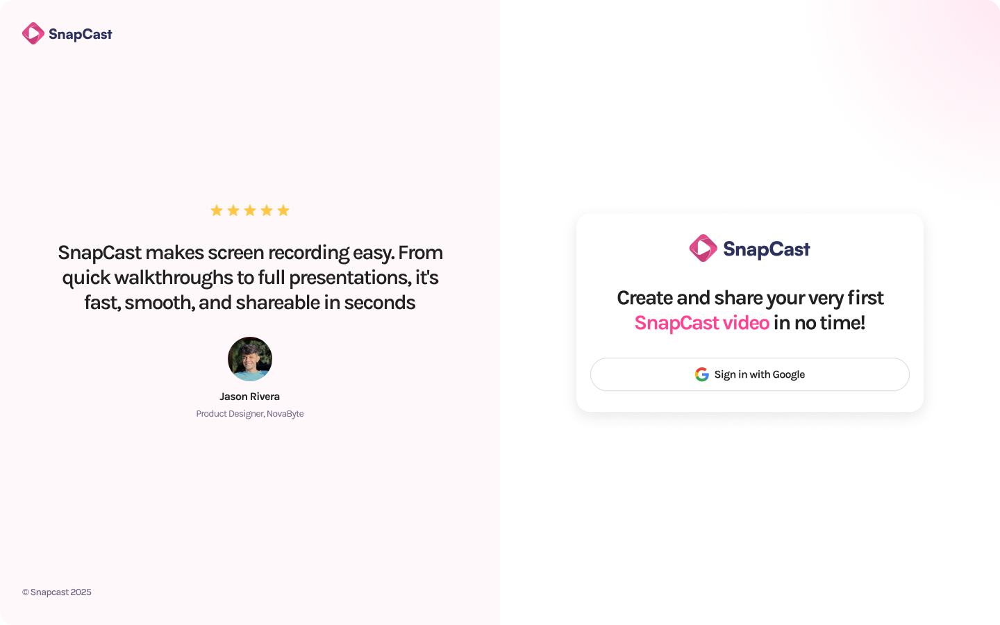

#  SnapCast – A Loom-Inspired Secure Web App for Content Creators

SnapCast is a full-stack web application that allows users to record, upload, and manage screen-recorded tutorial videos. Inspired by Loom, it integrates modern technologies with an emphasis on **privacy**, **performance**, and **security**.

---

##  Features

-  Google OAuth Authentication
-  In-browser screen recording
-  Upload videos with public/private visibility
-  Personal dashboard to manage uploaded videos
-  Fast, secure video streaming using Bunny.net CDN
-  Security protections using Arcjet
-  Clean and responsive UI with Tailwind CSS
-  Delete videos anytime
-  Deployed on Render

---

## Tech Stack & Tools Used

| Layer             | Tool/Tech                         | Use Case                                 | Install Command |
|------------------|-----------------------------------|------------------------------------------|-----------------|
| Frontend         | **Next.js + TypeScript**          | React framework with type safety         | `npx create-next-app@latest --typescript` |
| Styling          | **Tailwind CSS**                  | Utility-first CSS framework              | `npm install -D tailwindcss postcss autoprefixer`<br>`npx tailwindcss init -p` |
| Auth             | **BetterAuth + Google OAuth**     | Secure user authentication               | `npm install better-auth` *(or custom implementation)* |
| Backend API      | **Next.js API Routes**            | Server-side logic & routing              | *(Built-in with Next.js)* |
| ORM              | **Drizzle ORM**                   | Type-safe database querying              | `npm install drizzle-orm` |
| Database         | **Xata**                          | Serverless database                      | `npm install @xata.io/client` |
| CDN              | **Bunny.net**                     | Fast global video delivery               | *(No install, use API endpoints)* |
| Security Layer   | **Arcjet**                        | Protects APIs from bots & abuse          | `npm install arcjet` |
| Deployment       | **Render**                        | Cloud hosting for frontend & backend     | *(No install, deploy via dashboard)* |

---



---

##  Setup & Installation

### 1. Clone the Repo
```bash
git clone https://github.com/your-username/snapcast.git
cd snapcast
```
### 2. Install Dependencies
```bash
npm install
```
### 3. Set Up Tailwind CSS
```bash
npx tailwindcss init -p
```
### 4. Configure Environment Variables

```bash
# Next.js
NEXT_PUBLIC_BASE_URL=http://localhost:3000

# [Xata] Configuration used by the CLI and the SDK
# Make sure your framework/tooling loads this file on startup to have it available for the SDK
XATA_API_KEY=
DATABASE_URL_POSTGRES=

# Google
GOOGLE_CLIENT_ID=
GOOGLE_CLIENT_SECRET=

# BetterAuth
BETTER_AUTH_SECRET=
BETTER_AUTH_URL=http://localhost:3000

# Bunny
BUNNY_STORAGE_ACCESS_KEY=
BUNNY_LIBRARY_ID=
BUNNY_STREAM_ACCESS_KEY=

#ArcJet
ARCJET_API_KEY=
XATA_API_KEY=
```
### 5. Run Locally
```bash
npm run dev
```
## Acknowledgements

- JavaScript Mastery Tutorial
- Next.js Documentation

